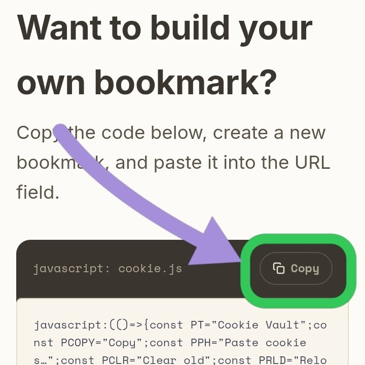

# Cookie Vault

Bookmarklet landing page for copying, pasting, and injecting browser cookies
(JSON, Header String, or Netscape format) on any site — no extension install.

## Structure

```
index.html            # markup only — pulls in css/styles.css and js/app.js
css/
  styles.css           # design tokens up top, sections in source
                         order, DESKTOP rules and MOBILE rules each
                         grouped in their own labeled section at the
                         bottom (see comments inside the file)
js/
  app.js               # all logic — i18n, bookmarklet builder,
                         test-file discovery/rendering, UI wiring
  worker.js             # NOT loaded by the site. Reference copy of
                          the Cloudflare Worker that proxies GitHub
                          API calls (see "Rate limits" below) — keep
                          this in sync with whatever's actually
                          deployed on Cloudflare, but it plays no
                          part in the page itself.
cookies/
  test-1/
    manifest.json       # { title, description, image, siteLink } — shared by every .txt below
    cookies.txt          # → one card
    preview.svg           # the card's image — any format works
                            (svg, png, jpg, webp); manifest just
                            points at the filename
  test-2/
    manifest.json
    cookies.txt           # → one card
    cookies2.txt           # → another card (same folder, same manifest, own content)
    preview.svg
```

Only two sample folders ship in this repo (`test-1`, `test-2`) to keep
things easy to scan — add as many more as you actually need following the
same shape below.

A floating 🍪 button (bottom-right, `#jumpFab` in `index.html`) is always
on screen and jumps straight to this section — useful since the gallery
sits well below the fold on both desktop and mobile.

## Assets you still need to add

`favicon.svg` (a 🍪 emoji icon) and the 5 mobile install screenshots
(`images/mobile-*.jpg`) ship in this repo and work immediately — nothing
to do there. Only these two are still missing; drop them in later and
everything picks them up automatically, no code changes needed.

| What | Where it's referenced | Expected file(s) |
|---|---|---|
| Favicon (fallback for old browsers) | `<head>` in `index.html` | `favicon.ico`, `favicon-32x32.png`, `favicon-192x192.png`, `apple-touch-icon.png` — all at the repo root, next to `index.html` |
| Social preview image | `og:image` / `twitter:image` in `<head>` | `og-image.png` at the repo root, 1200×630 recommended |

### Mobile install screenshots

Each mobile step has a `<div class="how-step-shot" data-shot="…">` right
under its text, with an `` already inside pointing at
`images/<data-shot-value>.jpg`. An empty slot (no `` inside) always
renders as a dashed placeholder box with a camera icon and the slot's
name instead of just vanishing, so it's obvious at a glance if a
screenshot is ever missing — swap the `src` on any of the five to update
that step's shot:

```html
<div class="how-step-shot" data-shot="mobile-copy-code">
  
</div>
```

The five, already filled in, in step order: `mobile-copy-code`,
`mobile-star-menu`, `mobile-saved-toast`, `mobile-edit-bookmark`,
`mobile-address-bar-run`.

## Test files layout: sidebar + gallery

The Test files section is a folder list on the left and a card gallery on
the right (on mobile, the folder list becomes a horizontally-scrolling
strip above the gallery instead of a side column). Click a folder in the
sidebar and the gallery on the right swaps to that folder's cards — this
is what keeps things easy to scan even with a lot of folders and files:
you're only ever looking at one folder's cards at a time, never one long
combined grid.

Each sidebar entry shows the folder's manifest title and how many `.txt`
files it holds, so you can tell folders apart without opening them.

Card images use `object-fit: contain`, not `cover` — a manifest image is
always shown in full (letterboxed on the card's background if its aspect
ratio doesn't match 16:9), never cropped to fill the frame.

## One card per .txt file

A folder can hold as many `.txt` cookie files as you want. **Every `.txt`
file becomes its own card** — each with its own Copy button (copies just
that file's content) and its own Open-site button. Cards from the same
folder share that folder's `manifest.json` for title / description / image
/ site link, since they're testing the same site — only the cookie content
differs per card.

`test-2/` above has two `.txt` files, so it produces two cards on the page,
both showing "Header String Sample" as the title but with `cookies.txt` and
`cookies2.txt` labeled separately, each copying its own content.

## Adding / editing a test entry

1. Make a folder under `cookies/`, e.g. `cookies/my-test/`.
2. Drop one or more cookie files in it (any name, any of the 3 supported
   formats) — each becomes a card.
3. Add an image (any name — **png, jpg, svg, webp all work fine**, the
   gallery doesn't care which one you pick; if the file is missing or
   fails to load, the card just falls back to a 🍪 placeholder instead
   of breaking).
4. Add `cookies/my-test/manifest.json`:
   ```json
   {
     "title": "My Test Site",
     "description": "One line about what this tests.",
     "image": "preview.svg",
     "siteLink": "https://example.com/wherever-this-should-open"
   }
   ```
5. Push. Every `.txt` file in that folder shows up as its own card
   automatically — nothing else to update, and no `cookieFile` field to set.

Removing a `.txt` file removes just that card; removing the whole folder
removes all its cards. There's no top-level manifest to keep in sync — each
test folder is self-contained.

## How each card works

- **Copy** fetches that card's own `.txt` file (only on first click —
  cached after that) and writes it straight to the clipboard. The raw text
  is never shown on the page.
- The arrow button opens the folder's `siteLink` in a new tab — that's the
  actual site to paste the cookies into via the bookmarklet panel.

## Discovery (how the page finds folders and their .txt files)

Two strategies, tried in order:

1. **GitHub API, via a Cloudflare Worker proxy** — on a
   `username.github.io/repo-name/` URL, the page calls a Cloudflare Worker
   instead of `api.github.com` directly. The Worker holds a GitHub token
   as a secret and forwards the request with it, so the 5000/hour
   authenticated limit is shared across all visitors instead of each
   visitor's browser burning through the 60/hour unauthenticated limit on
   its own IP. The Worker also edge-caches successful responses for 60
   seconds, so a burst of visitors barely touches the quota at all. See
   `js/worker.js` for the reference copy of what's deployed, and "Rate
   limits" below for setup. If the Worker itself gets rate-limited (rare),
   the page shows a clear message + retry button rather than a silent
   failure.
2. **Directory-listing fallback** — if the GitHub API path doesn't apply
   (not on a `github.io` URL, e.g. local preview), asks the server for
   `cookies/`'s own directory index for the folder names, then each
   folder's own index for its `.txt` files. This is what makes
   `python3 -m http.server` work locally.

If one folder's `manifest.json` is missing or invalid, its sidebar entry
still shows up (marked with ⚠) but its gallery pane explains the problem
instead of showing cards. A folder with a valid manifest but no `.txt`
files yet shows a small "no cookie files" note in its gallery pane instead
of silently disappearing from the sidebar.

## Rate limits — the Cloudflare Worker

`js/app.js` calls a Cloudflare Worker at a fixed URL (search for
`workers.dev` in `discoverFoldersViaGitHubApi`) instead of GitHub directly.
To stand up your own:

1. Create a GitHub Personal Access Token (classic, no scopes needed for a
   public repo) at `github.com/settings/tokens/new`.
2. Create a Cloudflare Worker, paste in `js/worker.js`, deploy it.
3. In the Worker's settings, add `GITHUB_TOKEN` as an encrypted secret
   (the token from step 1).
4. In `js/worker.js`, set `ALLOWED_ORIGINS` to your GitHub Pages origin so
   only your own site can spend the Worker's quota.
5. Point the `url` in `discoverFoldersViaGitHubApi` (in `js/app.js`) at
   your Worker's `/tree/<branch>` endpoint.

Without a Worker, swap that fetch back to `api.github.com` directly and
you're back to the unauthenticated 60/hour-per-visitor-IP limit — fine for
low traffic, easy to hit while actively testing.

## Local preview

```
python3 -m http.server 8000
```
then open `http://localhost:8000/`.

## Deploying

Push to GitHub, enable Pages (serve from the root of `main` or `/docs`),
done — it's a fully static site. Set up the Cloudflare Worker (see "Rate
limits" above) so the Test files gallery doesn't run into the
unauthenticated GitHub API limit under real traffic.
